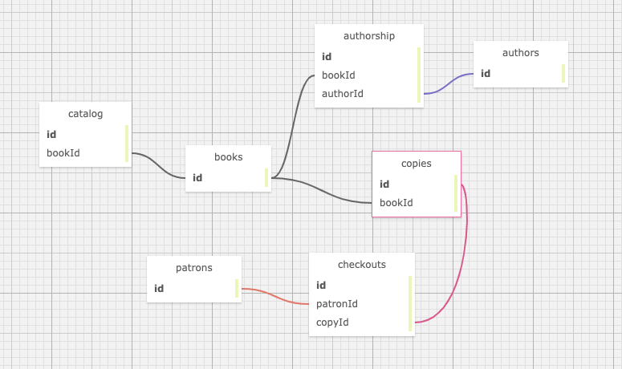

# Library

  

#### Let's read!

#### _By Nathan Fletcher_ and _Melissa Schatz-Miller_

* This app uses the identity tool to authenticate users.

## Technologies Used

* C#
* Object Oriented Programming
* ASP.NET Core MVC Framework
* Restful Routing Conventions
* Identity
* Entity Framework Core

## Known Issues
* There are no known issues at this time.
* Please contact me if you find any bugs or have suggestions. 

## License

_[MIT](https://opensource.org/licenses/MIT)_  

Copyright (c) 2021 Nathan Fletcher & Melissa Schatz-Miller

## Contact Information

_Nathan Fletcher @ github.com/nathanfletch_  
_Melissa Schatz-Miller @ github.com/tigertiger_

from StylistsController:
public ActionResult Details(int id)
    {
      dynamic myModel = new ExpandoObject();
      myModel.Client = _db.Clients.Where(client => client.StylistId == id).ToList();
      myModel.Stylist = _db.Stylists.FirstOrDefault(stylist => stylist.StylistId == id);
      return View(myModel);
    }

from ClientsController:

public ActionResult Details(int id)
    {
      Client client = _db.Clients.FirstOrDefault(client => client.ClientId == id);
      return View(client);
    }

@model HairSalon.Models.Client;

  

    <h1>Eau Claire's Salon</h1>
    <h3>Client File</h3>
  

  <h2>Name: @Html.DisplayFor(model => model.Name)</h2>
  <h3>Current Stylist: @Html.DisplayFor(model => model.Stylist.Name)</h3>
  
Notes: @Html.DisplayFor(model => model.Notes)

  
@Html.ActionLink("Edit this Client", "Edit", new {id = Model.ClientId}) 

  
@Html.ActionLink("View Client List", "Index") 

  
@Html.ActionLink("View Stylist List", "Index", "Stylists") 

https://github.com/chynnalew/HairSalon.Solution