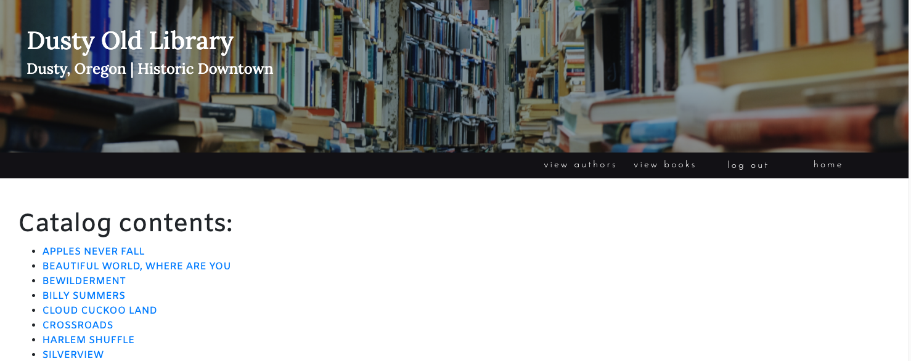

# Dusty Old Library

<p align="center"></p>  

#### Let's read!

#### _By Nathan Fletcher_ and _Melissa Schatz-Miller_

* This web application allows users to interact with the fictional Dusty Old Library. Sign up as a patron to browse the catalog, check out books, and return them! Sign up as a librarian to edit, manage, and add to the catalog.
* This app also uses an API connection to the NYT Best Seller List to assist in the population of the library catalog
* This app uses the identity tool to authenticate users

## Technologies Used

* C#
* Object Oriented Programming
* ASP.NET Core MVC Framework
* Restful Routing Conventions
* Identity
* Entity Framework Core

<p align="center" style="padding-top:30px; padding-bottom:30px;"></p>  

## Instructions

### Technology Requirements

* [.NET 5](https://dotnet.microsoft.com/download/dotnet/5.0)
* A text editor like [VS Code](https://code.visualstudio.com/)

### Setup/Installation


* Clone this repository to an empty folder or to your desktop, or download and open the Zip on your local machine. Instructions for cloning can be found [here](https://docs.github.com/en/github/creating-cloning-and-archiving-repositories/cloning-a-repository-from-github/cloning-a-repository).
* Open the Library folder in your preferred text editor. We'll come back to this shortly.

* Set up your SQL database:
  - Create a new ```appsettings.json``` file in your Library.Solution/Library folder
  - Copy the following code into that file, replacing YOUR_PASSWORD with your MySql password:
```
    {
      "ConnectionStrings": {
          "DefaultConnection": "Server=localhost;Port=3306;database=library;uid=root;pwd=YOUR_PASSWORD;"
      }
    }
```
* This repo includes database Migrations. To make use of those, simply run ```dotnet ef database update``` in your Library.Solution/Library folder


* Restore and build the project:
  - Navigate to the Library.Solution/Library folder in the command line or terminal  
    -- Run ```dotnet restore``` to restore the project dependencies  
    -- Run ```dotnet build``` to build and compile the project  

* Use the Web App:
  - Navigate to the Library.Solution/Library folder in the terminal
  - Run ```dotnet run``` 
  - If you would like to be able to continue viewing the site while making changes to its content, instead run ```dotnet watch run```
  - Access http://localhost:5000/ in your browser to view & interact with the web app

## Known Issues
* The book check-in function does not exist yet

## License

_[MIT](https://opensource.org/licenses/MIT)_  

Copyright (c) 2021 Nathan Fletcher & Melissa Schatz-Miller

## Contact Information

_Nathan Fletcher @ github.com/nathanfletch_  
_Melissa Schatz-Miller @ github.com/tigertiger_  
  
_Please feel free to reach out to us with suggested changes/improvements, or if you have any questions._